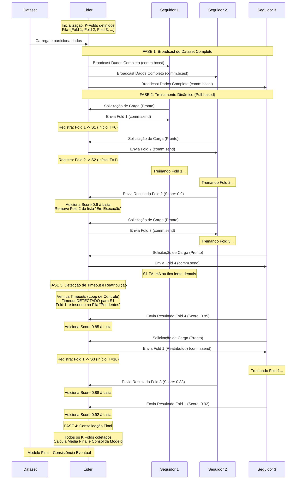

# Respostas às Perguntas Norteadoras - DistriFold

## **1. Qual tipo de comunicação será usado?**

**Resposta: Comunicação Assíncrona com Solicitação de Carga (Pull-based)**

- O sistema usa **OpenMPI** como middleware
- Modelo **Líder-Seguidor** (não mestre-escravo)
- Os Seguidores solicitam trabalho ao Líder quando estão ociosos ("Solicitação de Carga - Pronto")
- O Líder não envia todos os folds de uma vez, mas distribui dinamicamente conforme demanda

---

## **2. Quais são os tipos de mensagens e seus formatos?**

### **Tipos de Mensagens:**

#### 1. **Broadcast Inicial** (`comm.bcast`)
- **Direção:** Líder → Todos os Seguidores
- **Conteúdo:** Dataset completo
- **Formato:** Dados completos do dataset (array numpy ou estrutura de dados)
- **Quando:** Uma única vez no início da execução

#### 2. **Solicitação de Carga** 
- **Direção:** Seguidor → Líder
- **Conteúdo:** "Estou ocioso, mande um fold"
- **Formato:** Mensagem simples indicando disponibilidade
- **Quando:** Sempre que um Seguidor termina um fold ou inicia

#### 3. **Envio de Fold** (`comm.send`)
- **Direção:** Líder → Seguidor
- **Conteúdo:** Fold específico para treinamento
- **Formato:** 
  ```python
  {
    'fold_id': int,           # Ex: 1, 2, 3...
    'train_indices': list,    # Índices para treino
    'test_indices': list      # Índices para teste
  }
  ```
- **Quando:** Em resposta à solicitação de carga

#### 4. **Resultado de Treinamento**
- **Direção:** Seguidor → Líder
- **Conteúdo:** Score do modelo treinado
- **Formato:**
  ```python
  {
    'fold_id': int,           # Qual fold foi processado
    'score': float,           # Ex: 0.9, 0.85
    'pesos': array,           # Pesos do modelo (opcional)
    'timestamp': float        # Tempo de conclusão
  }
  ```
- **Quando:** Após completar o treinamento de um fold

#### 5. **Reatribuição de Fold**
- **Direção:** Líder → Seguidor
- **Conteúdo:** Fold que teve timeout
- **Formato:** Mesmo do "Envio de Fold"
- **Quando:** Quando o Líder detecta timeout de um Seguidor

---

## **3. TCP ou UDP (ou outro)?**

**Resposta: TCP (implícito no OpenMPI)**

### **Justificativa:**
- OpenMPI abstrai a camada de transporte, mas tipicamente usa **TCP** para garantir:
  - ✅ **Entrega confiável** das mensagens
  - ✅ **Ordem de chegada** preservada
  - ✅ **Controle de fluxo** automático
  - ✅ **Detecção de erros** e retransmissão

### **Por que não UDP?**
- UDP seria inadequado porque:
  - Perda de mensagens comprometeria os resultados dos folds
  - Sem garantia de ordem, resultados poderiam ser processados incorretamente
  - Sem controle de congestionamento em redes saturadas

### **Essencial para:**
- Garantir que os resultados dos folds não sejam perdidos
- Manter a integridade estatística do K-Fold Cross-Validation
- Permitir detecção confiável de timeouts

---

## **4. Conexões duradouras ou temporárias?**

**Resposta: Conexões Duradouras (Persistentes)**

### **Características:**
- O OpenMPI estabelece **conexões persistentes** entre o Líder e todos os Seguidores no início da execução
- As conexões permanecem ativas durante todo o ciclo de treinamento
- Não há overhead de estabelecimento/encerramento de conexão a cada mensagem

### **Vantagens:**
1. **Detecção de Timeouts:** 
   - Se um Seguidor não responde em N minutos, o Líder detecta pela conexão persistente
   
2. **Reatribuição Dinâmica:**
   - Folds podem ser reatribuídos rapidamente sem reconexão
   
3. **Eficiência:**
   - Comunicação eficiente sem overhead de reconexão
   - Menor latência nas trocas de mensagens

4. **Monitoramento:**
   - O Líder pode monitorar continuamente o estado dos Seguidores

---

## **5. Diagrama de Sequência - Comunicação do Sistema**

### **Descrição:**

O sistema **NÃO usa Multicast puro**, mas sim uma combinação de:

1. **Fase de Broadcast Inicial** (`comm.bcast`):
   - O Líder envia o dataset completo para TODOS os Seguidores simultaneamente
   - Isso é feito uma única vez no início

2. **Fase de Comunicação Ponto-a-Ponto**:
   - Cada Seguidor se comunica individualmente com o Líder
   - Solicitações e respostas são 1:1 (não há multicast de resultados)

3. **Agregação Final**:
   - O Líder coleta todos os scores individuais
   - Calcula a média final
   - Consolida o modelo final

### **Diagrama de Sequência (Mermaid):**



### **Explicação do Fluxo:**

1. **Inicialização:** O Líder carrega o dataset e define os K folds
2. **Broadcast:** Dataset completo é enviado para todos os Seguidores (uma única vez)
3. **Solicitação Pull:** Seguidores solicitam trabalho quando estão ociosos
4. **Distribuição Dinâmica:** Líder envia folds conforme demanda
5. **Monitoramento:** Líder registra timestamps e monitora timeouts
6. **Tolerância a Falhas:** Se S1 falha/timeout, Fold 1 é reatribuído para S3
7. **Agregação:** Líder coleta todos os scores e calcula média final
8. **Consistência Eventual:** Estado global consolidado após todos os folds

---

## **Modelo de Consistência**

### **Consistência Eventual**

O estado global do modelo só é consolidado após a unificação dos resultados parciais, permitindo que:

- Falhas individuais de nós sejam resolvidas por re-execução
- A ordem de chegada dos resultados não importe (problema monotônico)
- A integridade estatística do K-Fold Cross-Validation seja preservada
- O sistema continue operando mesmo com falhas parciais

### **Garantias:**

1. **Atomicidade por Fold:** Cada fold é uma unidade atômica de trabalho
2. **Idempotência:** Re-executar um fold produz o mesmo resultado
3. **Monotonia:** A ordem de agregação dos scores não afeta o resultado final
4. **Durabilidade:** Resultados são armazenados pelo Líder antes da consolidação

---

## **Resumo Técnico**

| Aspecto | Decisão | Justificativa |
|---------|---------|---------------|
| **Comunicação** | Assíncrona Pull-based | Balanceamento dinâmico de carga |
| **Protocolo** | TCP (via OpenMPI) | Confiabilidade e ordem garantida |
| **Conexões** | Persistentes | Eficiência e detecção de timeouts |
| **Padrão** | Broadcast + Ponto-a-Ponto | Eficiência inicial + controle fino |
| **Consistência** | Eventual | Adequado para problema monotônico |
| **Tolerância a Falhas** | Timeout + Reatribuição | Resiliência sem comprometer resultados |

---

**Data:** 2026-03-26  
**Projeto:** DistriFold - Sistema Distribuído de K-Fold Cross-Validation